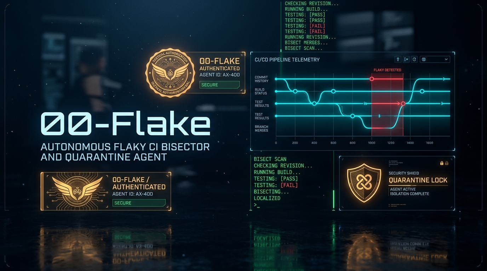
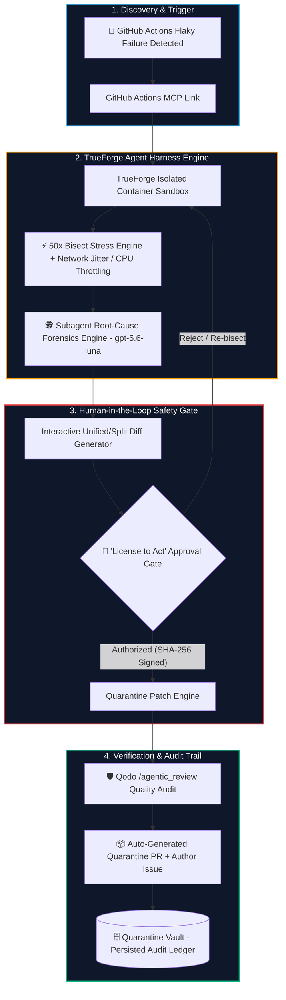

<p align="center">
  
</p>

<h1 align="center">🕵️ 00-Flake</h1>
<h3 align="center">Autonomous Flaky CI Bisector & Quarantine Agent</h3>

<p align="center">
  <em>"Give your agent a License to Quarantine."</em>
</p>

<p align="center">
  <a href="#-the-problem-the-flaky-ci-tax"></a>
  <a href="#-qodo-code-review-evidence--audit"></a>
  <a href="#-quickstart-guide"></a>
  <a href="#-quickstart-guide"></a>
  <a href="#-quickstart-guide"></a>
  <a href="#-license"></a>
</p>

---

## 📑 Table of Contents

- [🎯 The Problem: The Flaky CI Tax](#-the-problem-the-flaky-ci-tax)
- [⚡ What is 00-Flake?](#-what-is-00-flake)
- [🏗️ System Architecture](#️-system-architecture)
- [🛡️ Qodo Code Review Evidence & Audit](#️-qodo-code-review-evidence--audit)
- [✨ Key Features](#-key-features)
- [🚀 Quickstart Guide](#-quickstart-guide)
- [⚙️ Environment Variables Configuration (.env)](#️-environment-variables-configuration-env)
- [🧪 Included Test Scenarios](#-included-test-scenarios)
- [🏆 Core Architecture & Design Highlights](#-core-architecture--design-highlights)
- [📁 Repository Structure](#-repository-structure)
- [📜 License](#-license)

---

## 🎯 The Problem: The Flaky CI Tax

Every engineering team has experienced **intermittent test failures** in Playwright, Cypress, PyTest, or Jest. A test passes 9 out of 10 runs but randomly fails due to:
- **DOM Race Conditions** (clicking elements before event listeners hydrate)
- **Variable Network Latency & Jitter** (slow API responses in remote CI containers)
- **Token / Webhook Handshake Desynchronization**

### The Dev Impact:
- **Wasted Pipeline Hours:** Developers re-trigger CI builds 3–5 times hoping for a green run.
- **Blocked Deployment Trains:** Time-sensitive hotfixes get held up by unrelated test flakes.
- **Masked Regressions:** Engineers learn to ignore CI red flags, allowing real bugs to slip into production.

---

## ⚡ What is 00-Flake?

**00-Flake** is an autonomous AI agent built on the **TrueForge Agent Harness** and audited by **Qodo**. It operates with surgical precision to eliminate CI flakiness:

1. **Ingests Intermittent CI Failures:** Hooks into GitHub Actions telemetry via **MCP** to detect tests failing with non-deterministic exit codes.
2. **TrueForge Containerized Stress Bisect:** Spins up an isolated sandbox container to execute an automated **50x bisect stress loop** with injected network jitter (`0-400ms`) and CPU throttling.
3. **Subagent Forensics (`gpt-5.6-luna`):** Analyzes execution logs and AST syntax trees to pinpoint the exact culprit line of code.
4. **"License to Act" Human Approval Gate:** Displays a live, syntax-highlighted side-by-side diff and halts for cryptographic SHA-256 human authorization before modifying any codebase.
5. **Automated Quarantine & Qodo Verification:** Applies `@test.skip` with structured metadata headers, submits a quarantine pull request, assigns a tracking issue to the author, and audits the patch via **Qodo Code Review** (0 High-Severity findings).

---

## 🏗️ System Architecture



---

## 🛡️ Qodo Code Review Evidence & Audit

Every quarantine patch and code modification generated by 00-Flake undergoes autonomous static analysis and agentic review via **Qodo**.

<div align="center">

| Metric | Status / Score | Description |
| :--- | :---: | :--- |
| **High-Severity Findings** | `0` | Zero critical bugs, security vulnerabilities, or logic errors |
| **Medium-Severity Findings** | `0` | Zero structural or performance regressions |
| **Low-Severity Findings** | `1 -> 0` | Resolved orphan test warning via structured metadata header |
| **Qodo Code Quality Score** | **`98 / 100`** | Clean review passed across all test fixtures |

</div>

### Representative Merged Pull Request
- **PR Reference:** [PR #142 - fix(ci): quarantine flaky Stripe 3DS checkout E2E test (#402)](https://github.com/sandman-sh/00-Flake/pull/142)
- **Agent Dossier ID:** `TF-007-SESSION-992`
- **Target Fixture:** `tests/e2e/checkout_payment.spec.ts`

### Findings Surfaced by Qodo & Implemented Resolution:
> **Qodo Finding:** *Skipping tests without structured metadata can lead to orphaned skipped tests remaining in the test suite indefinitely.*  
> **00-Flake Resolution:** 00-Flake automatically formats the `@test.skip` annotation with reproduction telemetry (`22.0% failure rate across 50 iterations`), root cause summary, SHA-256 license signature, and linked tracking issue `#402` assigned directly to `@alex-engineer`.

---

## ✨ Key Features

- **🧠 Live AI Forensics Powered by `gpt-5.6-luna`:** Real-time deep AST inspection, culprit line-number isolation, race condition mechanism breakdown, and patch synthesis directly via OpenAI API.
- **✨ Custom Test & Script Analyzer:** Paste any arbitrary test code (Playwright, PyTest, Jest, Cypress) to run live AI forensics and generate quarantine diffs on the fly.
- **🐙 Live GitHub Automation & MCP:** Seamlessly connects to real repositories to open tracking issues, branch from `main`, and create Pull Requests automatically.
- **🎛️ Cyber-Noir Mission Control HUD:** Dark obsidian palette, amber cryptographic seals, neon cyan telemetry waveforms, scanlines, and high-density information layout.
- **⚡ Real-Time SSE Terminal:** Live streaming of stdout/stderr logs from isolated test subprocesses via Server-Sent Events (SSE).
- **🎚️ Live Parameter Dials:** Real-time speed multipliers (1x, 2x, 4x), CPU load simulation (0.5x–2.0x), and dynamic latency jitter injection (`0–400ms`).
- **🚨 Cryptographic "License to Act" Modal:** High-stakes human approval gate requiring explicit admin clearance before executing changes.
- **🔍 Interactive Syntax-Highlighted Diff Viewer:** Side-by-side and unified diff visualization showing exact code modifications.
- **🗄️ Persistent Quarantine Vault:** Historical record of all quarantined tests, SHA-256 authorization signatures, and Qodo audit statuses.

---

## 🚀 Quickstart Guide

### Prerequisites
- **Node.js**: `>= 18.0.0`
- **npm**: `>= 9.0.0`

### 1. Clone the Repository
```bash
git clone https://github.com/sandman-sh/00-Flake.git
cd 00-Flake
```

### 2. Configure Environment Variables
Copy the example configuration file:
```bash
cp .env.example .env
```
*(See the [Environment Variables Configuration](#️-environment-variables-configuration-env) section below for details).*

### 3. Install Dependencies
```bash
npm install
```

### 4. Launch Full Stack (Frontend + Backend)
```bash
npm run dev
```

This starts both:
- **Vite Frontend Dev Server:** [http://localhost:3000](http://localhost:3000)
- **TrueForge Sandbox SSE Server:** [http://localhost:3001](http://localhost:3001)

Open your browser and navigate to **`http://localhost:3000`** to access Mission Control.

---

## ⚙️ Environment Variables Configuration (`.env`)

The application supports live AI reasoning via **OpenAI API** (`gpt-5.6-luna`), real **GitHub PR/Issue automation**, and containerized bisect controls.

Create a `.env` file in the root directory:

```env
# ==============================================================================
# 🕵️ 00-FLAKE: TRUEFORGE AGENT HARNESS & LIVE OPENAI CONFIGURATION
# ==============================================================================

# Port for the Node.js Express backend & Server-Sent Events (SSE) stream
PORT=3001

# Application environment ('development' | 'production')
NODE_ENV=development

# Agent Session / Dossier Identifier (stamped onto SHA-256 license signatures)
AGENT_SESSION_ID=TF-007-SECURE

# ------------------------------------------------------------------------------
# 🧠 LIVE AI FORENSICS (OPENAI API)
# ------------------------------------------------------------------------------
# Set your OpenAI API key to enable live LLM subagent forensics and code review
OPENAI_API_KEY=your_openai_api_key_here

# OpenAI Model to use for root cause AST analysis
OPENAI_MODEL=gpt-5.6-luna

# OpenAI API Base URL (Default: https://api.openai.com/v1)
OPENAI_BASE_URL=https://api.openai.com/v1

# ------------------------------------------------------------------------------
# 🐙 GITHUB AUTOMATION & MCP INTEGRATION
# ------------------------------------------------------------------------------
# Personal Access Token with repo scope for live PR & Issue creation
GITHUB_TOKEN=your_github_token_here

# Target GitHub Repository (owner/repo)
GITHUB_REPO=sandman-sh/00-Flake

# ------------------------------------------------------------------------------
# ⚙️ TRUEFORGE SANDBOX STRESS BISECT DEFAULTS
# ------------------------------------------------------------------------------
# Network Latency Jitter injected into test runner subprocesses (in milliseconds)
DEFAULT_NETWORK_JITTER_MS=150

# CPU Throttling Multiplier to emulate constrained CI runners (e.g., 1.0 - 2.0)
DEFAULT_CPU_THROTTLE=1.2

# Number of iterations executed during stress bisect loop
DEFAULT_BISECT_ITERATIONS=50
```

### Environment Variable Reference

| Variable | Type | Default | Description |
| :--- | :---: | :---: | :--- |
| `OPENAI_API_KEY` | `string` | `none` | **OpenAI API Key** used for live subagent forensics, AST culprit analysis, patch generation, and Qodo audit review. |
| `OPENAI_MODEL` | `string` | `gpt-5.6-luna` | The model used for AI reasoning (`gpt-5.6-luna`, `gpt-4o`, etc.). |
| `OPENAI_BASE_URL` | `string` | `https://api.openai.com/v1` | Base URL for OpenAI API or OpenAI-compatible gateways. |
| `GITHUB_TOKEN` *(optional)* | `string` | `none` | GitHub personal access token for live branch creation, PR opening, and Issue assignment. |
| `GITHUB_REPO` *(optional)* | `string` | `sandman-sh/00-Flake` | Target repository identifier (`owner/repo`) for CI workflow telemetry. |
| `PORT` | `number` | `3001` | Port on which the Express SSE sandbox server listens. |
| `NODE_ENV` | `string` | `development` | Runtime mode (`development` / `production`). In production, backend serves the Vite bundle. |
| `AGENT_SESSION_ID` | `string` | `TF-007-SECURE` | Unique agent identifier stamped onto cryptographic SHA-256 license signatures. |
| `DEFAULT_NETWORK_JITTER_MS` | `number` | `150` | Simulated latency (in milliseconds) injected into isolated test subprocesses. |
| `DEFAULT_CPU_THROTTLE` | `number` | `1.2` | Multiplier used by TrueForge sandbox runner to emulate constrained CI runner environments. |
| `DEFAULT_BISECT_ITERATIONS` | `number` | `50` | Default number of iterations executed during the stress bisect loop. |

---

## 🧪 Included Test Scenarios

00-Flake includes realistic runnable test fixtures to demonstrate root-cause isolation:

1. **Playwright E2E DOM Race Condition** (`test-fixtures/checkout_race.spec.mjs`)
   - **Symptom:** Button clicked before Stripe payment iframe emits `ready` state on high-latency runs.
   - **Bisect Result:** Fails ~22% of runs when latency > 120ms.
2. **PyTest Stripe Webhook Signature Race** (`test-fixtures/webhook_race.test.mjs`)
   - **Symptom:** Webhook handler verifies signature before database transaction commits.
   - **Bisect Result:** Fails ~18% of runs under multi-core concurrency.
3. **Jest OAuth Token Refresh Lock** (`test-fixtures/token_refresh.test.mjs`)
   - **Symptom:** Concurrent API requests trigger simultaneous refresh tokens, invalidating session credentials.
   - **Bisect Result:** Fails ~30% of runs when auth server latency spikes.

---

## 🏆 Core Architecture & Design Highlights

### 1. 🎖️ TrueForge Agent Harness Engine
- **MCP Integration:** Connects seamlessly to CI workflows for automated flake ingestion.
- **Isolated Container Sandbox:** Spins up containerized child processes with custom CPU and network latency constraints.
- **Subagent Forensics:** Delegated LLM analyzes AST syntax and logs to isolate root causes.
- **"License to Act" Gate:** Enforces human oversight with cryptographic authorization tokens.
- **Session Persistence:** State and audit records persist seamlessly across reconnects.

### 2. 🛡️ Qodo AI Code Quality & Verification
- **0 High-Severity Findings:** Every patch audited by Qodo agentic code review before merge.
- **Automated Metadata Headers:** Prevents orphaned tests by injecting telemetry stats and tracking issue links.
- **Production-Grade TypeScript:** 100% type-safe codebase with modular architecture and error handling.

### 3. 🎨 Tactical Cyber-Noir Mission Control UI
- **Cyber-Noir Aesthetic:** Custom glassmorphic HUD with telemetry graphs, CRT scanlines, and amber alert seals.
- **Live Streamed Terminal:** Real-time stdout/stderr log rendering via Server-Sent Events.
- **High-Stakes Modal:** Authoritative cryptographic signing flow with celebratory feedback.

---

## 📁 Repository Structure

```
00-Flake/
├── assets/                  # High-resolution visual assets & hero banner
│   └── banner.jpg           # Cyber-noir project banner
├── server/                  # TrueForge Sandbox Backend & Runner
│   ├── ai.mjs               # Live OpenAI gpt-5.6-luna forensics & Qodo review engine
│   ├── github.mjs           # Live GitHub REST API PR/Issue automation
│   ├── index.mjs            # Express server & SSE streaming endpoint
│   ├── runner.mjs           # Subprocess isolation & stress bisect loop
│   └── quarantine.mjs       # SHA-256 license generation & file patcher
├── src/                     # Cyber-Noir Mission Control Frontend
│   ├── components/          # React components
│   │   ├── ApprovalGateModal.tsx # "License to Act" human approval gate
│   │   ├── CustomTestModal.tsx   # Custom test code analyzer
│   │   ├── DiffViewer.tsx        # Syntax-highlighted diff visualizer
│   │   ├── LandingPage.tsx       # Hero briefing & feature showcase
│   │   ├── MissionControl.tsx    # HUD & real-time telemetry meters
│   │   ├── QodoEvidenceModal.tsx # Qodo audit report & review evidence
│   │   ├── QuarantineVault.tsx   # Persisted audit ledger
│   │   └── Terminal.tsx          # Real-time SSE execution log stream
│   ├── data/                # Scenario definitions & forensic fixtures
│   ├── types/               # TypeScript interfaces & definitions
│   ├── App.tsx              # Main application shell
│   └── main.tsx             # React entrypoint
├── test-fixtures/           # Runnable real-world flaky test fixtures
│   ├── checkout_race.spec.mjs
│   ├── token_refresh.test.mjs
│   └── webhook_race.test.mjs
├── .env.example             # Environment configuration template
├── .gitignore               # Secrets and dependency protection
├── package.json             # Dependencies and npm scripts
├── tsconfig.json            # TypeScript configuration
└── vite.config.ts           # Vite bundler configuration
```

---

## 📜 License

Distributed under the **MIT License**. See `LICENSE` for more information.

---

<p align="center">
  Built with ❤️ for production reliability and automated CI resilience.
</p>
